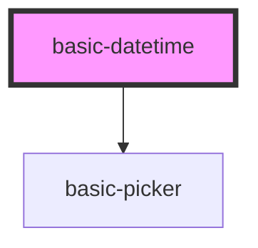

# basic-datetime

<!-- Auto Generated Below -->

## Properties

| Property       | Attribute       | Description                                                                                                                                                    | Type      | Default        |
| -------------- | --------------- | -------------------------------------------------------------------------------------------------------------------------------------------------------------- | --------- | -------------- |
| `date`         | --              | Expose current date outside the component.                                                                                                                     | `Date`    | `undefined`    |
| `format`       | `format`        | Display format of the date. Available variables:    YYYY - for year    MM - for month    DD - for day    HH - for hour    mm - for minute    ss - for second   | `string`  | `'MM/DD/YYYY'` |
| `max`          | `max`           | The maximum date that should be a valid argument for Date.parse().                                                                                             | `string`  | `undefined`    |
| `min`          | `min`           | The minimum date that should be a valid argument for Date.parse(). https://developer.mozilla.org/en-US/docs/Web/JavaScript/Reference/Global_Objects/Date/parse | `string`  | `undefined`    |
| `pickerBuffer` | `picker-buffer` | Number of visible values in a picker before and after the current value.                                                                                       | `number`  | `3`            |
| `showHeader`   | `show-header`   | Show or hide header for each picker column.                                                                                                                    | `boolean` | `undefined`    |
| `value`        | `value`         | The initial value date that should be a valid argument for Date.parse().                                                                                       | `string`  | `undefined`    |

## Events

| Event        | Description                                                               | Type               |
| ------------ | ------------------------------------------------------------------------- | ------------------ |
| `dateChange` | Fires every time the date was changed. Emits the new date as Date object. | `CustomEvent<any>` |

## Dependencies

### Depends on

- [basic-picker](../picker)

### Graph

----------------------------------------------

*Built with [StencilJS](https://stenciljs.com/)*
