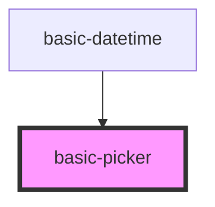

# basic-picker

<!-- Auto Generated Below -->

## Properties

| Property    | Attribute    | Description                                                                       | Type     | Default     |
| ----------- | ------------ | --------------------------------------------------------------------------------- | -------- | ----------- |
| `buffer`    | `buffer`     | Number of visible values in picker before and after the current value             | `number` | `3`         |
| `max`       | `max`        | The maximum value;                                                                | `number` | `undefined` |
| `min`       | `min`        | The minimum value;                                                                | `number` | `undefined` |
| `minDigits` | `min-digits` | Minimum length of a number. If the number is shorter, it will be prefixed by 0's. | `number` | `2`         |
| `value`     | `value`      | The initial value;                                                                | `number` | `undefined` |

## Events

| Event          | Description                                                  | Type               |
| -------------- | ------------------------------------------------------------ | ------------------ |
| `pickerChange` | Fires every time the value was changed. Emits the new value. | `CustomEvent<any>` |

## Dependencies

### Used by

 - [basic-datetime](../datetime)

### Graph

----------------------------------------------

*Built with [StencilJS](https://stenciljs.com/)*
